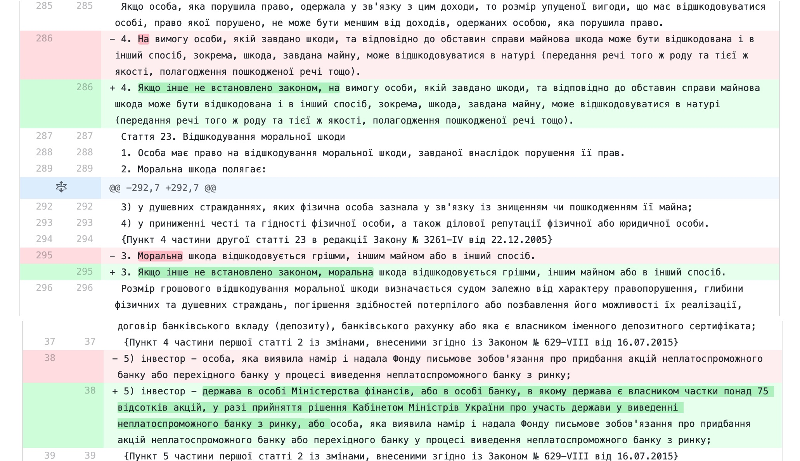

# Закон 2571-д (антиколомойський) - Приклад застосування Git для законів

Даний проєкт це спроба організувати правки, що пропонуються законопроєктом 2571-д, у зручному для аналізу вигляді.

Читати оригінали документів та порівняльні таблиці це вправа для досить витривалих, з гарним зором і купою часу. Git дозволяє відносно просто систематизувати роботу з текстовими документами. І що найголовніше, Gitlab та Github мають дуже гарні візуальні інструменти порівняння тексту - тобто не потрбіно в сторінці тексту А4 шукати одне слово що було змінено автором - система підсвітить та покаже такі зміни.

Хочете швидко поглянути, як це все виглядає -> [тоді вам сюди](https://gitlab.com/andrew.ga/ua-law-2571-d/-/merge_requests/1/diffs?lang=uk)

проєкт було перенесено на Gitlab тому, що він має українську версію інтерфейсу, на відміну від GitHub.

## Структура даних
Гілка `master` (основна) містить оригінальні тексти законів.
Зміни згідно проєкту 2571-д знаходяться у гілці `2571-d`.

Для прикладу створено запит на злиття `2571-d` до `master` -> https://gitlab.com/andrew.ga/ua-law-2571-d/-/merge_requests/1/diffs?lang=uk

Саме в цьому режимі найкраще видно переваги такого підходу роботи з текстовими документами при роботі з законодавством, у порівнянні з величезними таблицями у Word документах.

## Як такий підхід може допомогти опрацювати 16 000 внесених правок від депутатів?

1. Щонаменше, у такому вигляді простіше бачити, куди і які зміни вносяться, а ніж намагатись розібратись у порівняльній таблиці;
2. Маючи всі правки і тексти в єдиному репозиторії дозволяє використовувати автоматизовані методи, а значить прискорити роботу над аналізом правок
- аналіз на дублікати
- візуальний аналіз в контексті документу
- відслідковування авторства
- просто швидше можна працювати з усіма правками

Приклад як можна викорисати Gitlab для організації роботи над законопроєктом:

#### Варіант 1.
Найпростіший спосіб це якщо правки подаються у формі коли вони вже інтегровані в кінцеві закони. Тобто прямо в тексті закону зроблені зміни.
В такому разі система автоматично зрозуміє де і які правки були внесені - навіть якщо їх 100 000.

Що для цього потрібно
1. Тексти з внесеними правками (вихідні оригінали повинні бути у форматі, що є на сайті [Верховної Ради через API](https://data.rada.gov.ua/open/main/api)). Або просто взяти версії, що у цьому репозиторії https://gitlab.com/andrew.ga/ua-law-2571-d)
2. Для кожної пачки правок від одного депутата створити нову гілку Git яка базується на гілці `2571-d`
3. Додати файли з пропонованими правками
4. Створити `Запит на злиття` двох гілок і аналізувати зміни що були запропоновані

#### Варіант 2.
На практиці можна витягнути необхідні зміни з Word документів і інтегрувати їх в репозиторій, але для цього знадобиться на багато більше зусиль... тож краще Варіант 1.

## Чому Git для законів
Початкове натхнення, щоб задуматись над застосуванням Git до області законів, [було викликане статею](https://blog.abevoelker.com/gitlaw-github-for-laws-and-legal-documents-a-tourniquet-for-american-liberty/) про те як місто Вашингтон (округ Колумбія, США) виклали всі свої законодавчі акти на GitHub та відгуки ІТ спільноти на hackernews.

Задуматись над необхідність подібного інструмента для законодавчої області підштовхнув також досвід вивчення різного роду законів та змін до них на https://zakon.rada.gov.ua/laws. Особливо вразили закони, які вносили зміни до інших законів - "слово 'абсурд' у другому реченні третього абзацу пункту тринадцять статті 26" - це ж супер складно відслідкувати та опрацювати. Ймовірність помилок в таких випадках при створенні закону - надзвичайно висока.

В той же час ІТ індустрія вже років 30 (з появи системи CVS) має автоматизовані системи контролю версій, основна ціль яких - робота зі змінами у текстових документах.

То чому ж не спробувати використати те, що гарно працює в ІТ для законів.

Одна з останніх крапель це історія навколо закону 2571-д, відомого в народі як "антиколомойський". Коли група депутатів подала більше 16 000 правок до законопроєкту і комітет верховної ради змушений якось їх опрацьовувати.

Більше мене в цій історії навіть вражає не той факт скільки правок було подано, а як потім депутату, що має голосувати прочитати все це?
Як не витративши тижнів розібратись в усіх правках без нормальнох візуалізації. Ті ж порівняльні таблиці на сайті Верховної ради - це звісно краще ніж нічого, тільки дуже вмотивовані люди будуть вчитуватись в те куди і які зміни вносити.

## Джерела даних
Діючі тексти законів взяті з сайту https://data.rada.gov.ua/ за допомогою відкритого [API](https://data.rada.gov.ua/open/main/api)

Текст законопроєкту та порівняльна таблиця взяті з сайту http://w1.c1.rada.gov.ua/pls/zweb2/webproc4_1?pf3511=68492

## Застереження
Автор проєкту не є юристом і даний проєкт є лише дослідженням. Кожен, хто використовує результати цієї роботи - використовує їх на власний ризик. Автор не несе відповідальності за результати та наслідки використаття цього проєкту.
